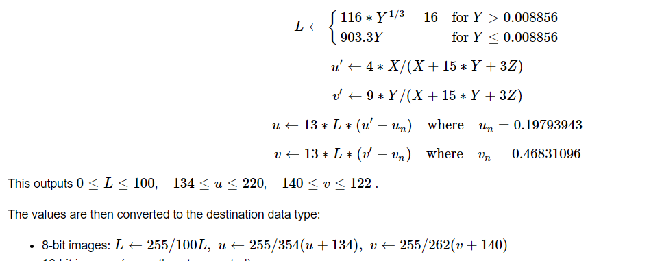

# Team 15

| Name                       | sec | BN  |
| -------------------------- | --- | --- |
| Ahmed Hossam Mohamed Sedky | 1   | 2   |
| Ahmed Mohammed Abdelfatah  | 1   | 5   |
| Ehab Wahba Abdelrahman     | 1   | 22  |
| Mo'men Maged Mohammed      | 2   | 12  |
| Mohanad Alaa Ragab         | 2   | 31  |

---

## Libraries versions

- numpy version **1.21.3**
- cv2 version **4.5.4-dev**
- matplotlib version **3.4.2**

---

## Code architecture

- Threshold

  - Threshold Techniques

    - Otsu

      ```
       Histogram of image is calculated
       Calculate mean of background and object
       Threshold value is value that produces the maximum variance between background and object

      ```

    - Optimal

      ```
       Initial and Optimal threshold values is calculated
       Optimization of the threshold value is applied by comparison of old and new threshold values
       Final threshold value reached when the change in threshold equal zero

      ```

    - Spectral

      ```
       Similar to otsu technique but two threshold values are calculated according
       to variance High and low threshold values.
       Double thresholding is applied
       Values higher than high threshold value set to 255
       Values lower than high threshold and higher than low threshold values are set to predefined number

      ```

  - Threshold types

    - Global

      ```
       Threshold value is applied over the whole image

      ```

    - Local

      ```
      Choose number of regions you want to divide the image for
      Choose threshold technique you want to apply
      Global threshold is applied for each region
      Each region has unique threshold value

      ```

- RGB to LUV color space

  - In case of 8-bit and 16-bit images, R, G, and B are converted to the floating-point format and scaled to fit 0 to 1 range

  ```
      copied_image =copied_image /255.0
  ```

  - convert RGB to XYZ using this matrix
    $$
           \left(\begin{array}{cc}
           X\\
           Y\\
           Z
           \end{array}\right)
           = \left(\begin{array}{cc}
           0.412453 & 0.357580 & 0.180423\\
           0.212671 & 0.715160 & 0.072169\\
           0.019334 & 0.119193 & 0.950227
           \end{array}\right) +
           \left(\begin{array}{cc}
           R\\
           G\\
           B
           \end{array}\right)
    $$

  ```
           x = 0.412453 * copied_image[i, j][0] + 0.357580 * copied_image[i, j][1] + 0.180423 * copied_image[i, j][2]
          y = 0.212671 * copied_image[i, j][0] + 0.715160 * copied_image[i, j][1] + 0.072169 * copied_image[i, j][2]
          z = 0.019334 * copied_image[i, j][0] + 0.119193 * copied_image[i, j][1] + 0.950227 * copied_image[i, j][2]
  ```

  - then follow these steps to get the final pixel values which in luv color space
    

  ```
      if (y > 0.008856):
              L = (116.0 * (y **(1/3)) ) - 16.0
          else:
              L = 903.3 * y

          u_dash = 4.0*x /( x + (15.0*y ) + 3.0*z)
          v_dash = 9.0*y /( x + (15.0*y ) + 3.0*z)

          U = 13.0 * L * (u_dash -0.19793943)
          V = 13.0 * L * (v_dash -0.46831096)

          image [i,j] [0] = ( 255.0/100.0) *L
          image [i,j] [1] = ( 255.0/ 354.0) *(U+134.0 )
          image [i,j] [2] = (255.0/ 262.0) *(V +140.0)
  ```

- Kmeans clustering

  - Select a value for the number of clusters k and maximum number of iterations

  ```
      def __init__(self, K=5, max_iters=100, plot_steps=False):
          self.K = K
          self.max_iters = max_iters
  ```

  - Select k random points from the data as a centeroids

  ```
  random_sample_idxs = np.random.choice(self.n_samples, self.K,   replace=False)
  self.centroids = [self.X[idx] for idx in random_sample_idxs]
  ```

  - Associate each data point with the nearest center calculating the Euclidean Distance.

  ```
   def _create_clusters(self, centroids):
      clusters = [[] for _ in range(self.K)]
      for idx, sample in enumerate(self.X):
          centroid_idx = self._closest_centroid(sample        centroids)
          clusters[centroid_idx].append(idx)
      return clusters
  def _closest_centroid(sample, centroids):
      # distance of the current sample to each centroid
      distances = [euclidean_distance(sample, point) for point in centroids]
      closest_index = np.argmin(distances)
      return closest_index
  def euclidean_distance(x1, x2):
      return np.sqrt(np.sum((x1 - x2) ** 2))
  ```

  - Calculate the centroid and mean of all data points in the cluster.

  ```
  def _get_centroids(self, clusters):
      # assign mean value of clusters to centroids
      centroids = np.zeros((self.K, self.n_features))
      for cluster_idx, cluster in enumerate(clusters):
          print(f"len cluster: {cluster_idx} = {len(cluster)}")
          cluster_mean = np.mean(self.X[cluster], axis=0)
          print(f"cluster_mean {cluster_idx}: {cluster_mean}")
          centroids[cluster_idx] = cluster_mean
      return centroids
  ```

  - repeat second, third and forth steps

    - Stopping Criteria:
      1. the Maximum number of iterations is reached.
      2. Centroid of the newly formed cluster does not change.

    ```
    for _ in range(self.max_iters):
        # Assign samples to closest centroids (create clusters)
        self.clusters = self._create_clusters(self.centroids)
        if self.plot_steps:
            self.plot()

        # Calculate new centroids from the clusters
        centroids_old = self.centroids
        self.centroids = self._get_centroids(self.clusters)

        # check if clusters have changed
        if self._is_converged(centroids_old, self.centroids):
            break
    ```

- Region growing

  - get random seeds

  ```
    seeds = []
      for i in range(3):
          x = np.random.randint(0, img_gray.shape[0])
          y = np.random.randint(0, img_gray.shape[1])
          seeds.append(Point(x, y))
  ```

  - neighboors are 8 pixels near to seed pixel

  ```
  def selectConnects(p):
      if p != 0:
          connects = [Point(-1, -1), Point(0, -1), Point(1, -1),
                      Point(1, 0), Point(1, 1), Point(0, 1),
                      Point(-1, 1), Point(-1, 0)]
      else:
          connects = [Point(0, -1), Point(1, 0), Point(0, 1), Point(-1, 0)]

  return connects
  ```

  - compare neighboors to seed pixel within certain threshold if it within this threshold neighboor pixels will be added to the region

  ```
      grayDiff = getGrayDiff(img, currentPoint, Point(tmpX, tmpY))

      if grayDiff < thresh and seedMark[tmpX, tmpY] == 0:
          seedMark[tmpX, tmpY] = label
          seedList.append(Point(tmpX, tmpY))
  ```

  - repeat comparing new seed with their neighboors and add satisfying neighboors to the region then pop the current point from the stack of seed list

  ```
   while (len(seedList) > 0):
      currentPoint = seedList.pop(0)
  ```

  - finally return the region

- Mean Shift Segmentation

  - First we should extract the feature space from the image

  ```python
  features = np.zeros((image.shape[0] * image.shape[1], 5))
    pixel_counter = 0
    for i in range(image.shape[0]):
        for j in range(image.shape[1]):
            pixel = image[i][j]
            for k in range(5):
                if (k >= 0) & (k <= 2):
                    features[pixel_counter][k] = pixel[k]
                else:
                    if k == 3:
                        features[pixel_counter][k] = i
                    else:
                        features[pixel_counter][k] = j
            pixel_counter += 1

  ```

  - Then compare the euclidean distance between the current mean and the feature space to get the values that are below the threshold.

  ```python
  new_features_indices = []

    if random_mean:
        current_mean = np.random.randint(0, len(features))
        current_mean = features[current_mean]

    for feature_index, feature in enumerate(features):
        ecl_dist = calculate_distance(current_mean, feature)

        if ecl_dist < threshold:
            new_features_indices.append(feature_index)

    return new_features_indices, current_mean
  ```

  - Get the mean values of all the below_threshold features and calculate the mean of their RGB values and index positions.

  ```python
    red_mean = np.mean(features[new_features_indices][:, 0])
    green_mean = np.mean(features[new_features_indices][:, 1])
    blue_mean = np.mean(features[new_features_indices][:, 2])
    rows_mean = np.mean(features[new_features_indices][:, 3])
    columns_mean = np.mean(features[new_features_indices][:, 4])


  ```

  - Then we compare them with the current mean and we find the closest row in below_threshold_arr that has i, j nearest to mean_i and mean_j.

  ```python
  if mean_e_distance < iteration:
        rgb_pixel = np.zeros((1, 3))
        rgb_pixel[0][0] = red_mean
        rgb_pixel[0][1] = green_mean
        rgb_pixel[0][2] = blue_mean
  ```
